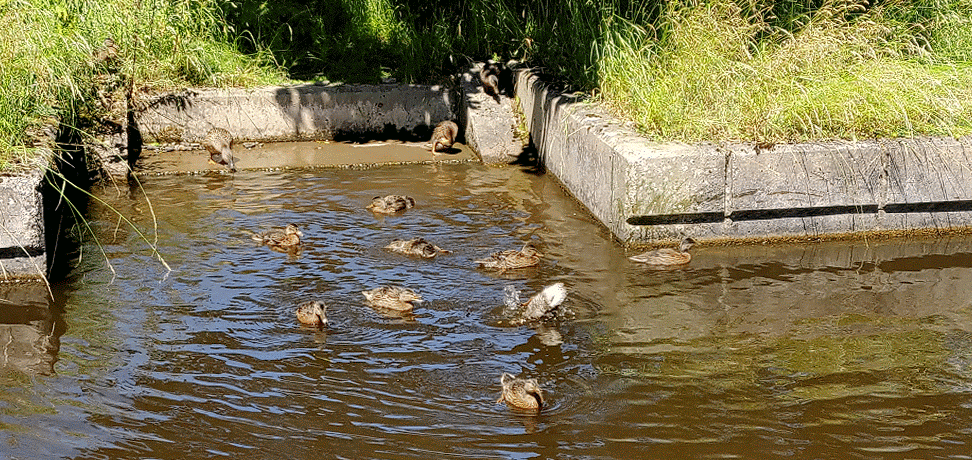
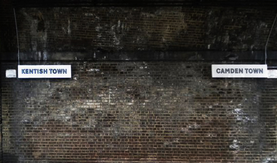

> An example of a decisive fact is that concentrations of power characterise our society. Concentrations of power do not necessarily respect person's rights. 
Concentrations of power force persons to concentrate on participating in competition and power games, in order to create a social position for themselves. Concurrently with the concentrations of power dominating our conscious mind and being decisive to our situations, the significance of our fellow humans diminishes. And our own significance becomes the significance we have for concentrations of power, the growth of concentrations of power, and the conflicts of concentrations of power. It is decisive that persons try to find ways of existing with as small concentrations of power as possible.

<table style="width:100%">
  <tr>
    <th  align="left" padding-left: 80px; style="padding-right: 15px;" >

👔 Full Stack Developer @ <a href="https://defty.com/" style="color:#555555;">defty</a> 
💻 M.Sc - Computer Science - <a href="https://www.birmingham.ac.uk/postgraduate/courses/taught/computer-science/computer-science.aspx" style="color:#555555;">Class of 2017</a> 
👔 Freelance Designer 
👔 Product Designer @ <strike><a href="https://www.freeindex.co.uk/media/listingpics/617/678/attacking-design-slpy-adventures-wearable-sleeping-bag-12.jpg" style="color:#555555;">SLPY</a></strike> 
🔥 Entrepreneurial Spark - Accelerator 
👔 Director & Designer @ <strike><a href="https://www.instagram.com/attackingdesign/" style="color:#555555;">Attacking Design</a></strike> 
🐣 Leeds University - Buisiness Incubator 
👔 Junior Designer @ <strike><a href="http://www.disruptive-innovation.co.uk/" style="color:#555555;">Disruptive Innovation</a></strike> 
🎨 B.Des - Product Design - <a href="https://engineering.leeds.ac.uk/product-design" style="color:#555555;">Class of 2010</a> 

</th>
    <th style="width:50%"> <iframe width="100%" height="380" scrolling="no" frameborder="no" src="https://attackingpixels.com/1/index.html"></iframe> </th> 
  </tr>
</table>

🌍 Currently living in London. I've worked, lived and traveled all over the place. I grew up in a small village in Cheshire, on the boarder of North Wales. 
<!-- 
It’s a picturesque spot, with canals and rolling countryside, which I enjoy going back to for the trails and clean air. 

 -->

<!--  -->
<!-- ### Standard features:

* Easy editable content in **Markdown** files (posts, pages and parts)
* **SEO** (sitemap generation, robot.txt, meta and OpenGraph Tags)
* **Social** sharing (Twitter, Facebook, Google, LinkedIn)
* **Comments** (Facebook)
* **Images** lazy loading and `webp` support (gatsby-image)
* Post **categories** (post list filtering)
* Full text **searching** (Algolia)
* **Contact** form (Netlify form handling)
* **RSS** feed
* **PWA** (manifest.json, offline support, favicons)
* Google **Analytics**
* **Favicons** generator (node script)
* **Material UI** (@next) -->

<!-- ### Advanced features:

* Easy customizable base **styles** via `theme` object (fonts, colors, sizes)
* **Components** lazy loading (social sharing, comments)
* **ESLint** (google config)
* **Prettier** code styling
* Custom webpack `CommonsChunkPlugin` settings
* Webpack `BundleAnalyzerPlugin`
* Contact **form validation** (react-material-ui-form-validator) -->

🎧 My soundtrack’s Techno, Acid and House. Bought myself turntables aged 15 and never progressed past a bedroom DJ. Failing to to curb my vinyl habit. Record labels I recommend you check out: <a href="https://www.discogs.com/label/19066-Ed-Banger-Records" style="color:#555555;">+ Ed Banger</a> <a href="https://www.discogs.com/label/46768-Boysnoize-Records" style="color:#555555;">+ BNR Records</a> <a href="https://www.discogs.com/label/45909-Anjunadeep" style="color:#555555;">+ Anjunadeep</a> <a href="https://www.discogs.com/label/1466-BPitch-Control" style="color:#555555;">+ BPitch Control</a> <a href="https://www.discogs.com/label/17675-Toolroom-Records" style="color:#555555;">+ Toolroom </a>

<iframe width="100%" height="166" scrolling="no" frameborder="no" allow="autoplay" src="https://w.soundcloud.com/player/?url=https%3A//api.soundcloud.com/tracks/156893117&color=%23ff5500&auto_play=false&hide_related=false&show_comments=true&show_user=true&show_reposts=false&show_teaser=true"></iframe>

 
  💡 Goals for 2019: Fastpack Offas Dyke, Visit Albania & Tackle Electronics Projects

