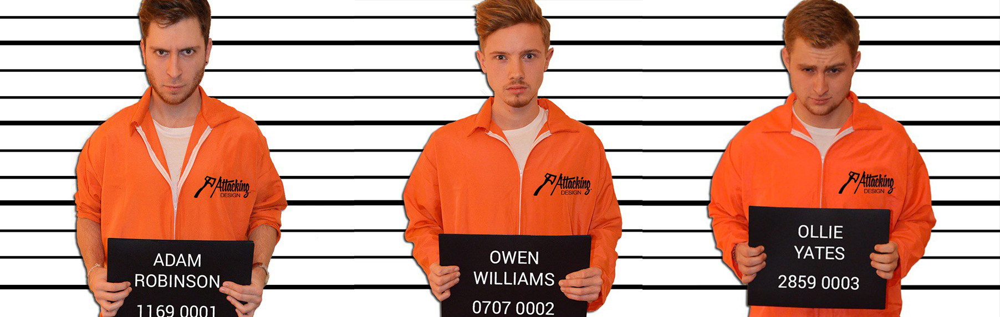
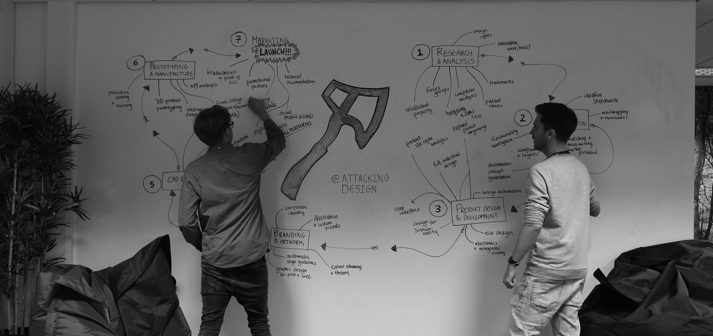
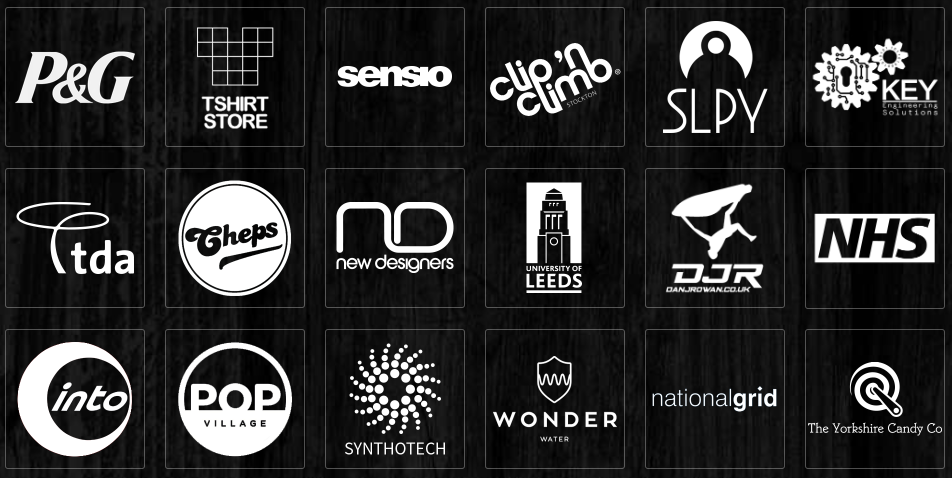
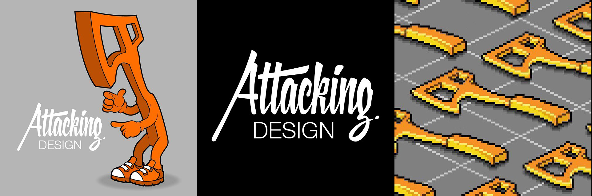

Attacking Design was founded by myself and two fellow Leeds University Product Design graduates, [Owen Williams](https://www.linkedin.com/in/ojwil/) and [Oliver Yates](https://www.linkedin.com/in/ollieyates/). It later grew to employ and a small team of local designers within the city of Leeds. In Oct 2015 the agency was selected for the Entrepreneurial SPARK business Accelerator program backed by PWC & Natwest. In Jan 2017 we collectively decided to close the agency down and take what we had learnt forward into our own projects.

>  <strong>Mission Statement:</strong> Attacking Design is a fully integrated design agency based in Leeds, West Yorkshire. We are a small consultancy of creative experts who facilitate a full suite of graphic design, branding, product development services. For us, no challenge is too large. We harbor a passion for our craft and are united in our goal to deliver the finest possible results. Together we will develop the strategy and execution needed to take your vision into the world, through all possible creative avenues.

Attacking Design was responsible for producing work for high value clients such as the NHS (Drinkaware), Procter & Gamble (Gillette) and  National Grid. In June 2015 our wearable sleeping bag product (SLPY) became a finalist in Virgins “Pitch to Rich”. 

Projects made possible by Attacking Design:
* The complete development of [SLPY](https://www.attackingpixels.com/SLPY-Wearable-Sleeping-Bag/) wearable sleeping bag
* Graphic Designs for the [T-Shirt Store](https://www.tshirtstoreonline.com/us/)
* Developing [Thirsti](http://www.thirsti.com/) a smart water consumption tracker featured on Dragons Den
* [Sign In](https://www.attackingpixels.com/Sign-in/) - Branding & UI/UX 
* Developing a new hair removal test rig for P&G (Gillette) 
* Yorkshire Candy Company - Advent calander  
* 3D Modeling the Sensio 2015 cataloge
* [DJR](http://djrltd.com/) - Jetski Graphics
* The wonder water alcohol awareness campaign (NHS Partners) 
* Producing instructional and marketing visuals for Synthotech, a robotics company specialising in domestic gas supply
* Developing a sustainable modular housing system for Blok Build used across projects in the UK
* More graphics, illustration and branding than you can shake a stick at...

