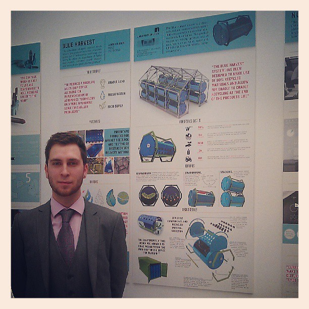

 

The Blue Harvest system has been designed to make use of 90% recycled materials and allow for cradle to cradle recycling at the end of the products life. An affordable kit-based product which aims to give producers who were previously priced out of hydroponics technology the ability to utilise its advantages of faster crop rotation, increased growth stability and herbicide and pesticide free produce.

The final product developed into a kit form from the initial design. This came after research into distribution and storage of stock. The size of the device meant that it would be difficult to hold large volumes in storage and a solid frame would be harder to transport. Developing a frame that would perform as required and could be broken down into components that could fit within the main chamber was key.

The initial design used a submerged pump that produced high pressure and allowed water to escape through a rail system into the chamber. This is a standardised technology used within aeroponics however we felt that through research into emerging technologies a better solution could be devised. Ultrasonic misters were the solution developed that could be bought pre-fabricated in bulk, cheaply from China. This system also had the secondary benefit of being more economical to power over the life of the product over a traditional submerged pump.

The largest development for the product over the initial concept was the use of a recycled intermediate bulk container for the body of the device. The initial concept planned to use storm gauge PVC pipe for the chamber of the design however this was very expensive and far less sustainable. Secondary benefits came from using this component as the form of the device as the chamber had a good volume of free space to support a large root network and allow for the growth of tubular plants (a flexibility that the majority of competitors don’t match)
 
## New Designers Exhibition - 2014

 

