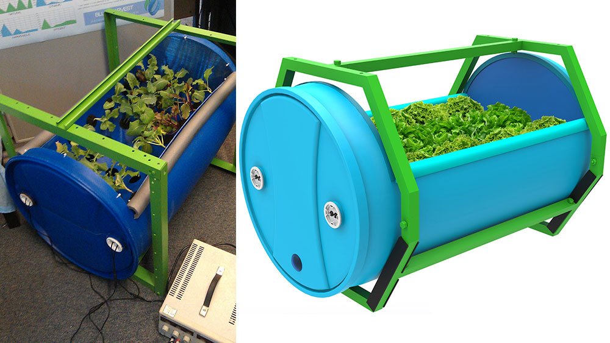
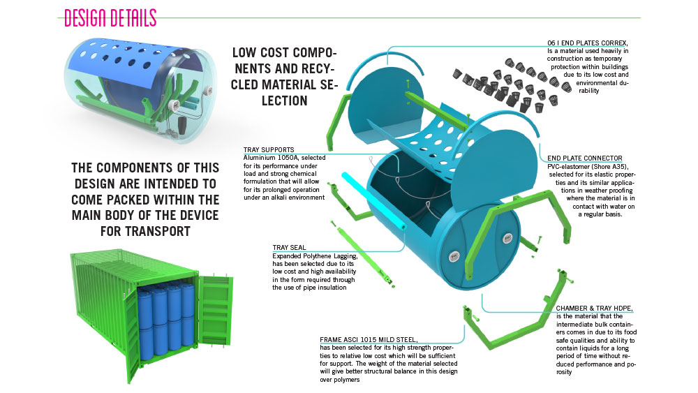
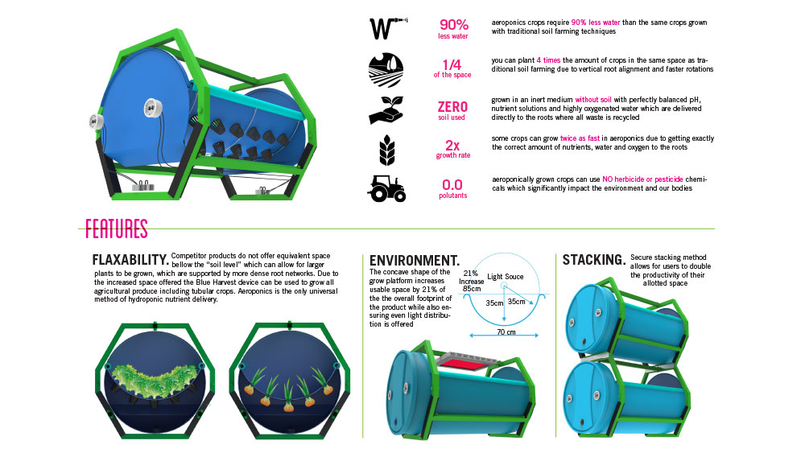
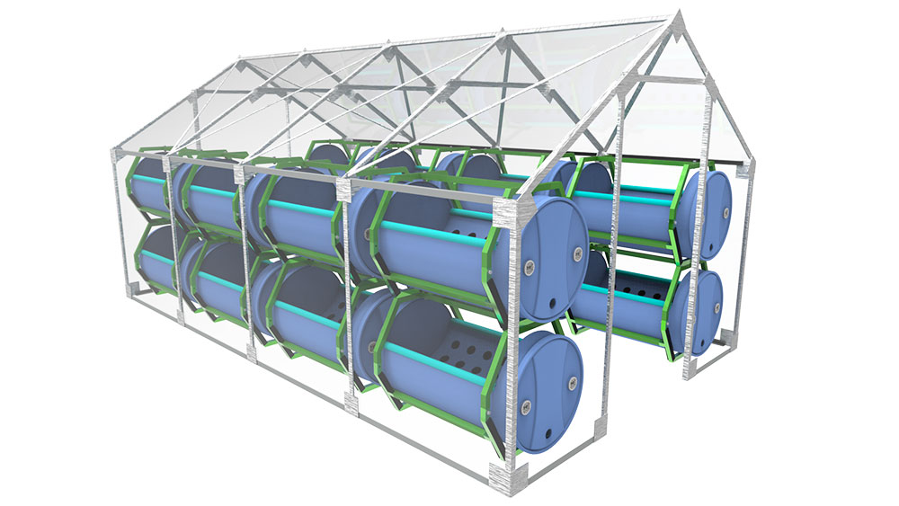
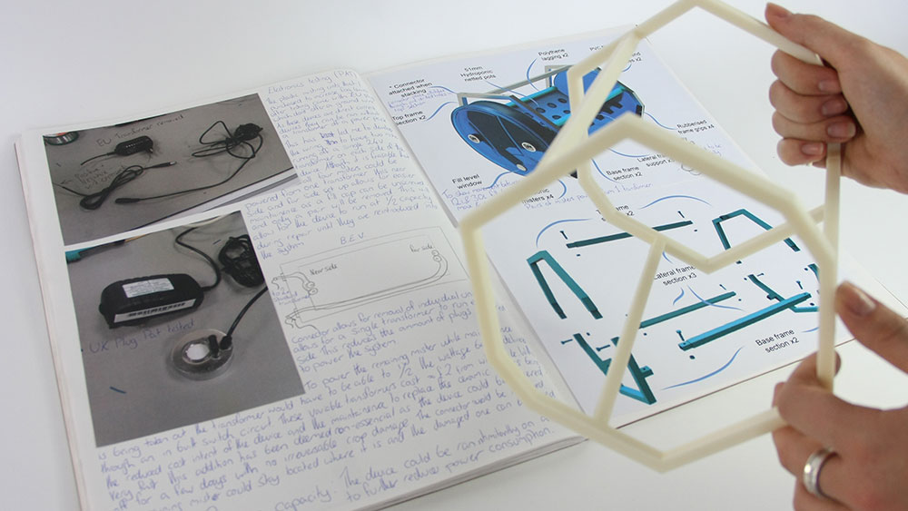

 
 

This concept concentrated on reducing the cost of entry into commercial hydroponics, while making use of recycled materials and IBCs (intermediate bulk containers) which are a surplus to processed food production. The product was intended to be delivered as a self contained kit for commercial agriculture, small city co-ops (reducing the pressure on rural arable land) and for disaster relief. 

The final product developed into a kit, from the initial pre-built design. This came after research into distribution and storage of stock. The physical dimentions of the device meant that it would be difficult to hold large volumes in storage and a solid frame would be harder to transport. Developing a frame that would perform as required and could be broken down into components that could fit within the main chamber was key. Using recycled IBC's as the main housing also allowed for easy stacking and distribution when supplied in ISO freight containers.

The initial design used a submerged pump that produced high pressure and allowed water to escape through a rail system into the chamber. This is a standard technology used within aeroponics however after research into emerging technologies a more effective, lighter and cheaper solution could be devised. Ultrasonic ceramic misters were key as they could be be purchased pre-fabricated in bulk, cheaply from China and required only light electrical modifications to be fit for purpose. This system also had the secondary benefit of being more economical to power over the life of the product over a traditional submerged pump.

The largest development for the product over the initial concept was the use of a recycled intermediate bulk container for the body of the device. The initial concept planned to use storm gauge PVC pipe for the chamber of the design however this was very expensive and far less sustainable. Secondary benefits came from using this component as the form of the device as the chamber had a good volume of free space to support a large root network and allow for the growth of tubular plants (a flexibility that the majority of competitors don’t match)
 
## New Designers Exhibition - 2014

I was asked by The University of Leeds as one of 12 students to showcase my concept at the 2014 new designers exhibition in London (Angel, Islington).

 

