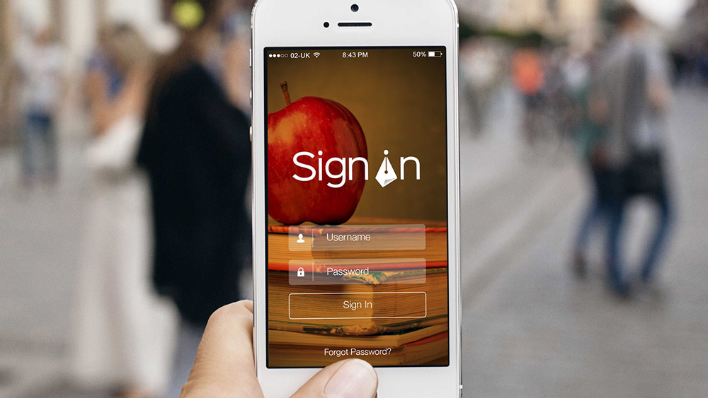
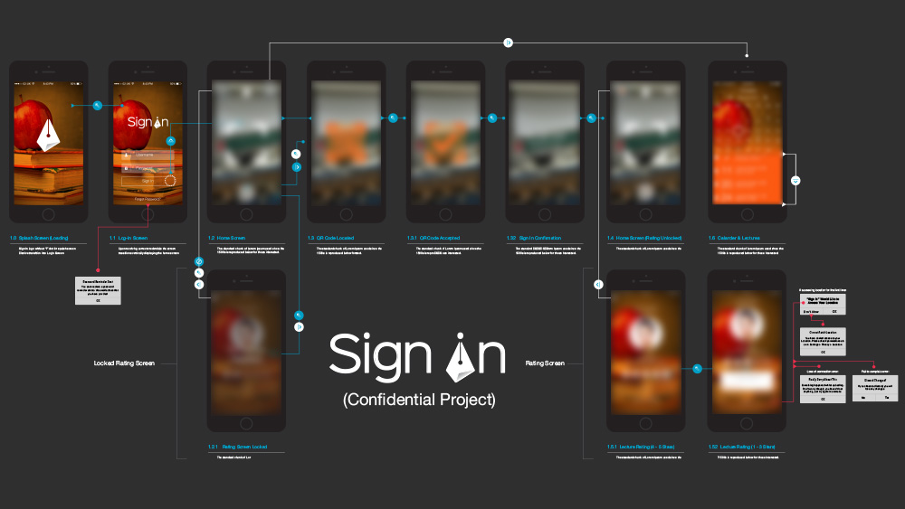
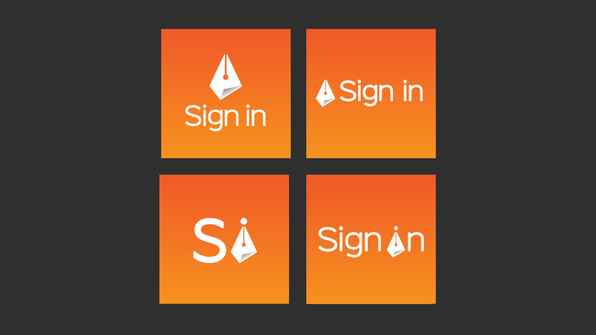
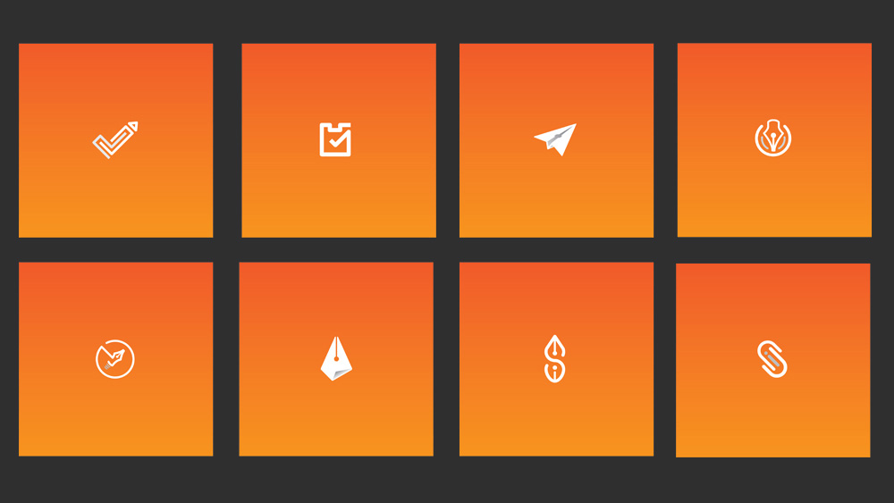

While @ [Attacking Design](https:www.attackingpixels.com/Attacking-Design/) Cheps Entertainment, an app development start-up, set Attacking Design the brief of carrying out UI/UX work for their Sign In project. We producded worked for both Cheps and Sign In to produce full brand identities, to support in the launch of these ventures. Since it's launch Sign In progessed to the later stages of #Voom Pitch to Rich 2018 and has received £150,000 in financial backing.

The Sign In, app was developed in partnership with a number of Universities to monitor variables around student attendence and lecturer performance. The overall aim of the app is to improve the university experience for students and ensure they get the best quality education for their money.

The key the challenge of the app design was making sure user experience was fast, as the app was intended to be used at the start of a lecture and then put away when all information was harvested. Another challanging aspect was ensuring the app was useful and something that students would want to have on their phones. On top of this we had to ensure the software developers understood the exact flow of the user through the app for easy offloadng.

With the Sign In app receiving multiple rounds of funding, I hope it will soon be a familiar sight on student phones around the country.

