  

<strong>Project Area:</strong> Networking, Privacy, MAC Randomisation, Tracking, Visualisation  
<strong>Technologies:</strong> Mongo, Kali, Raspberry Pi, Javascript, Python & Flask, D3.js 
<strong>Mark:</strong> Distinction 79% - [Download PDF](https://www.attackingpixels.com/1/Robinson-1854199.pdf)

Data will be collected over a two-week period from public spaces in Birmingham during peak pedestrian hours. This data will be gathered using the Raspberry Pi packet sniffer built for the project. All data collected across this time frame will be cleaned and aggregated using a Pandas script for local storage in a MongoDB Database.
A web portal will use this data to demonstrate patterns in the data along with the facility to geolocate devices previously visited networks using the WiGLE API.

The three main phases of this project were data collection, data processing and data visualisation. These stages can be seen in the high-level graphical representation of the project shown bellow Fields represented in blue show external data sources which were captured for the project. 

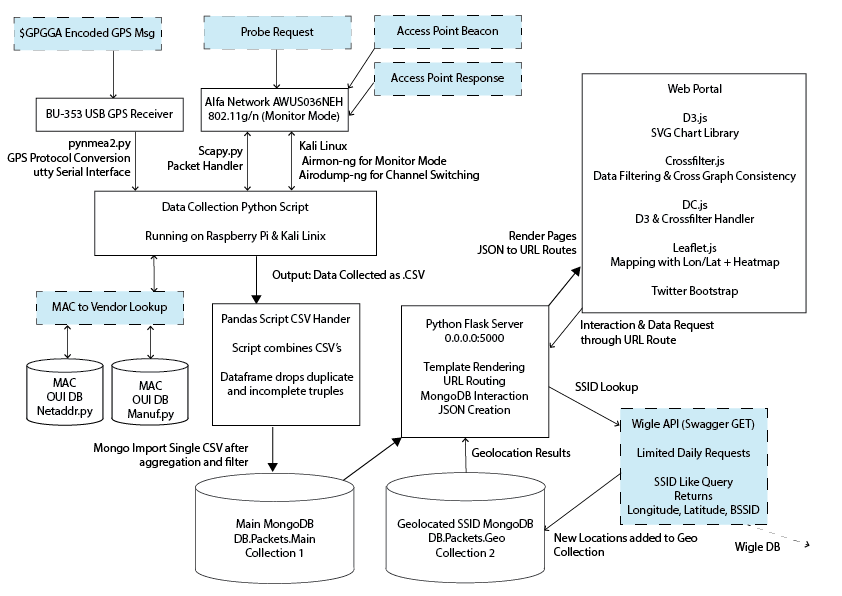

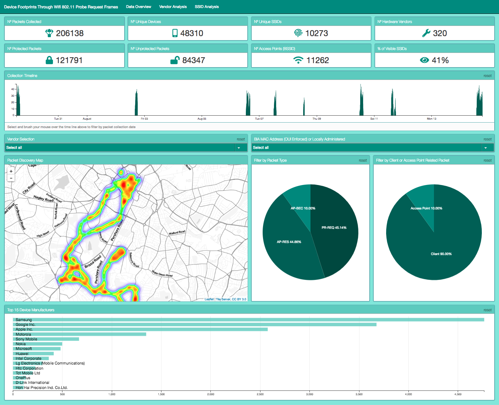

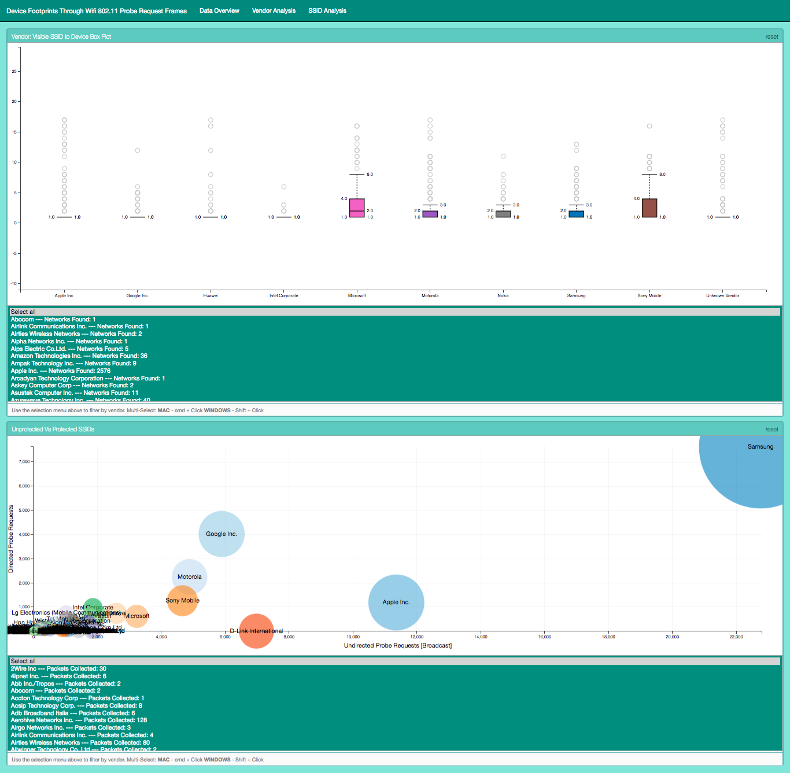

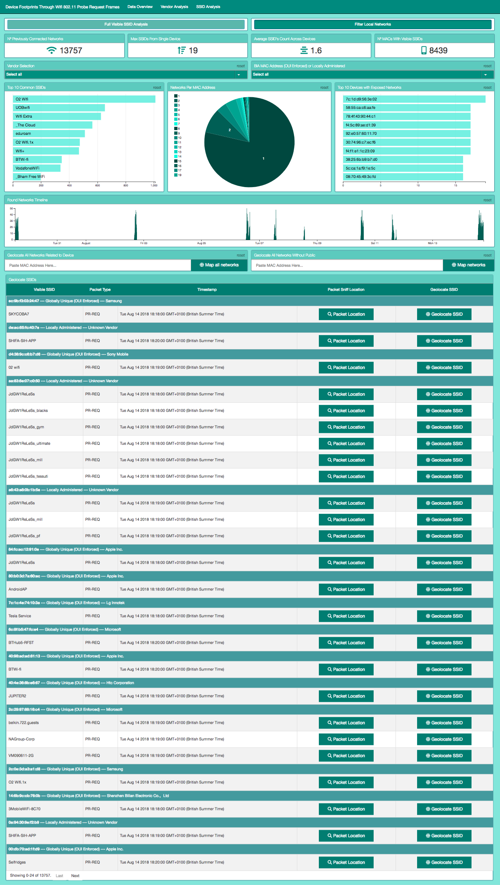

The directed probe data captured from the MacBook Air during closed device testing has been used to demonstrate the Geolocation functionality of this project. As
all of the networks related to the MacBook Air are known it allows for the easier identification of false positives for this project.

13 out of the 16 SSIDs given out in the directed probes were successfully geolocated, which can be seen bellow. The geolocation has rather successfully displayed three regions of interest in the heatmap which can be defined by areas with more than one networks in a local range (< 5miles). These three regions are Birmingham where I’ve been studying, my parents’ home in Cheshire and a region of Spain where I’ve lived
for several months. The accuracy of the locations is wholly dependent on collected data supplied by WiGLEs users. 

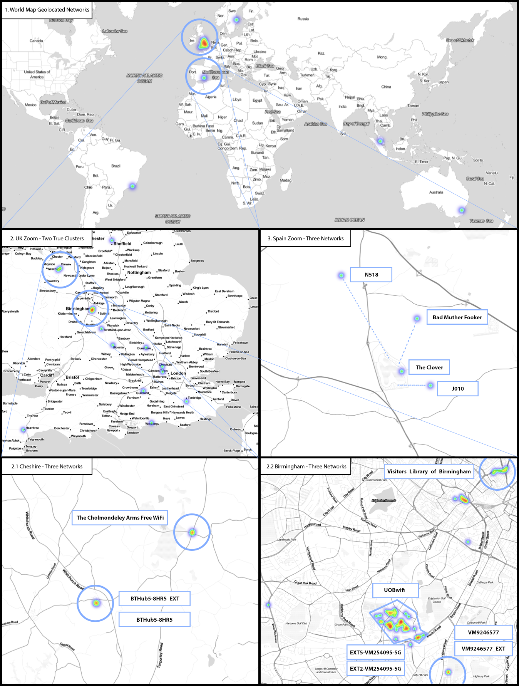

All the networks in the UK are extremely accurate to within 10 meters whereas the four networks located in Spain are less so with an accuracy of around 500m. However, this is an extremely remote region of Murcia, and I’m surprised that these networks were even present at all. 

These positives help to demonstrate the comprehensive network coverage the open source database WiGLE has. The false positives in Brazil, Sweden, The Philippines and Australia are all for the same SSID of J010 which was located in Spain. It was indicative of the incorrect hits within the geolocation results showing more generic/common SSIDs as noise.

Within the noise of the UK, results were hits for The Clover Pub (a common pub name) and multiple results for incorrect BT Home Hub routers. I believed going into this project that all the factory SSIDs assigned to BT Home Hubs would be unique however upon closer inspection it appears that BT recycles the factory SSIDs across their routers.

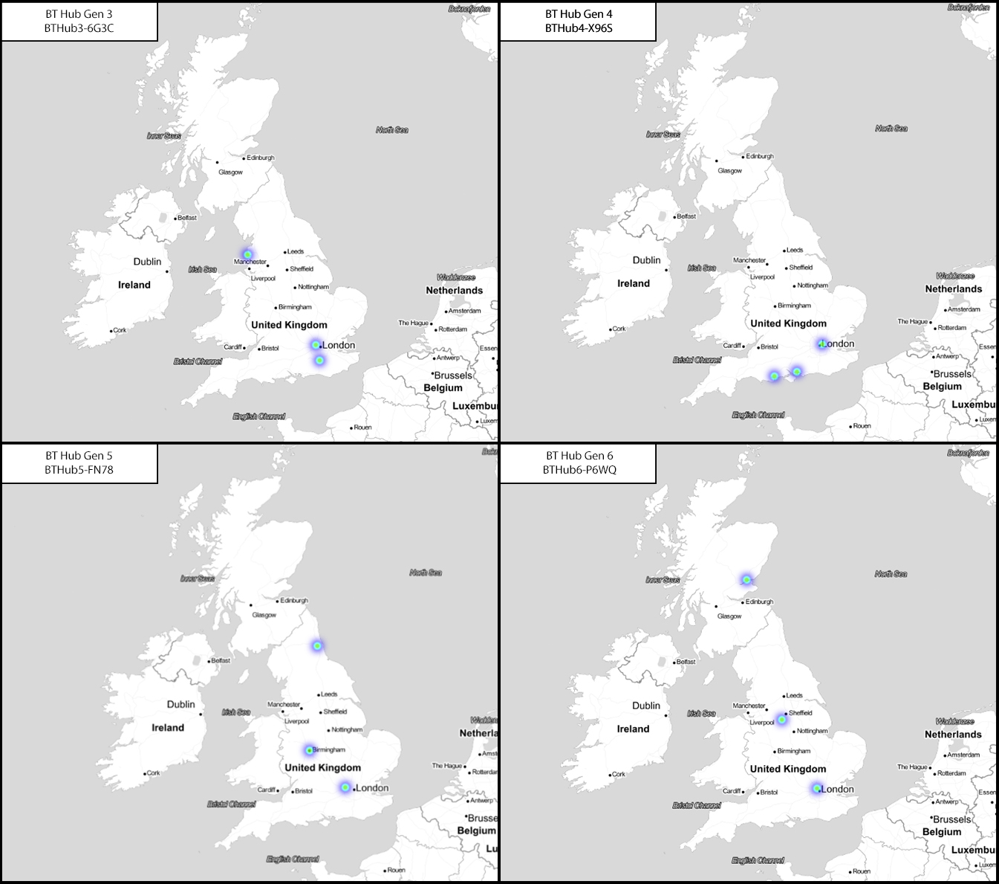

Home networks are likely the single most identifying SSID transmitted in a directed probe request. Unless the factory SSID of a router from one of the major UK ISPs has been changed, the predictable naming patterns make them easy to distinguish within the data. ‘BT-HUB’ was found in 1356 directed probe packets making it the most popular of the ISPs within my dataset. Due to this, I decided to take a more in-depth look at the multiple hits given by BT Home Hub routers. Initially, I believed that they might have been due to people moving to a new house and taking their routers with them.
However, when looking into the ‘collected on’ timestamps provided in the WiGLE return set, there were too many overlaps. For example, there was a single BT SSID which in all three of its locations had been spotted almost monthly for a year. When you consider that internet contracts are usually 12 months (9 months at a minimum), it didn’t make sense that these were the same network. I compared all the generations of BT home
hub routers from 3 onwards, and it seems that the factory SSIDs are used no more than three times. As each generation of the router has almost 60 million possible router names why BT re-uses them is uncertain, and I was unable to find anything on the BT website or documentation that explains this phenomenon.

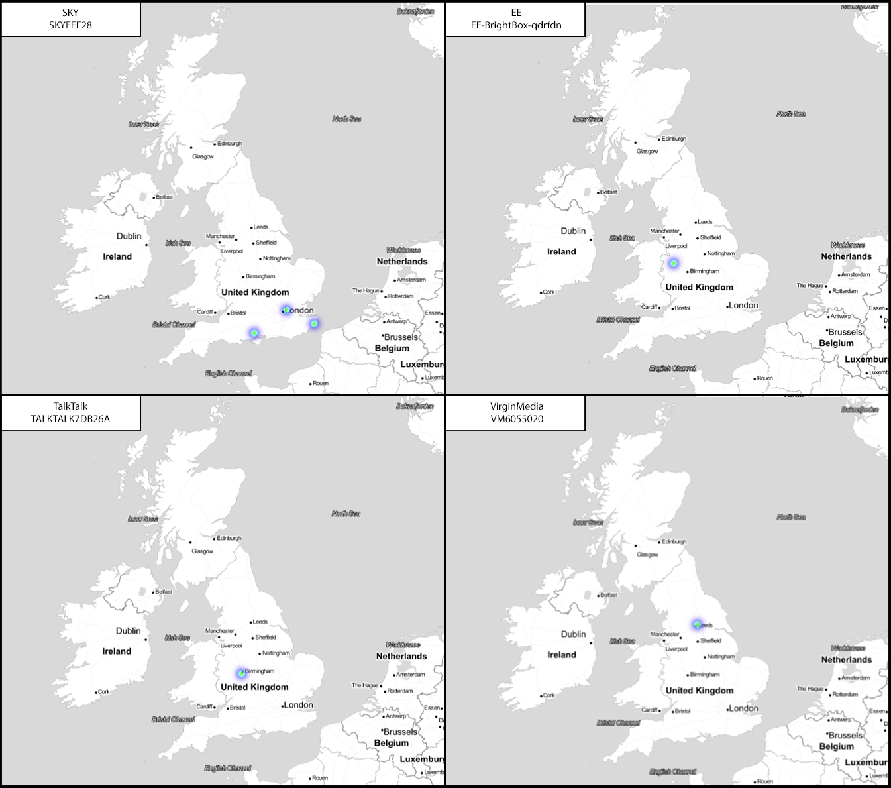

Two of the SSIDs within the MacBook Airs probes contained SSIDs for network extensions of the same prefix. If extender addresses were found in the probes of a device, then it would help to get a better fix on which of the home networks that may appear multiple times would be related to a device. 

As stated I had varying success when geolocating devices prior locations from the data I’ve collected around Birmingham. The system currently geolocates all the networks that are affiliated to a MAC address with no means to manually filter networks out of consideration. Therefore, when a device had a multiple common SSIDs within in the list of related networks, there would be an almost incomprehensible amount of noise. I did
implement a feature in the system that would allow geolocation searches to exclude free and public networks from the results, however, this relied on whether members of the WiGLE community had tagged networks as ublic and the resulting level of tagging has been insufficient to filter. 

There were networks that were stored within my MacBook’s memory such as ‘eduroam’ and ‘Starbucks WiFi’ that if were transmitted in the probe burst would have made finding my three relevant areas much more difficult.

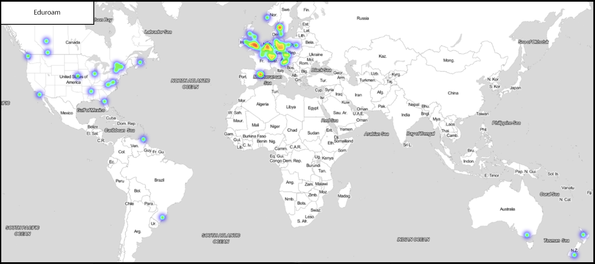

Within the collected data set SSIDs were discovered that were capable of defining possible travel patterns which can be illustrated bellow through train operator onboard services. Airport SSIDs were rather common throughout the dataset which is
understandable, as while people are waiting at an airport or if they have been delayed they are likely to connect to a Free Wi-Fi service to pass the time.

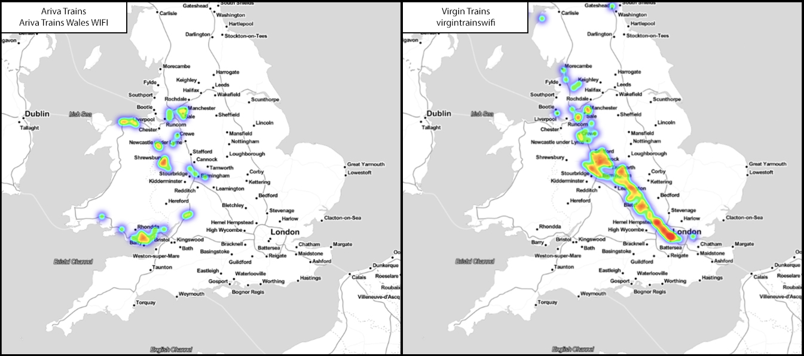

Not all instances of airports within the data gave clean hits. If airports used a generic SSID such as ‘Airport Free WiFi’ as shown bellow, then the device could be shown to have visited up to 10 airports. Likewise, Wi-Fi services for Schiphol and Frankfurt gave many nationwide hits, although the highest density was on the Airports themselves.

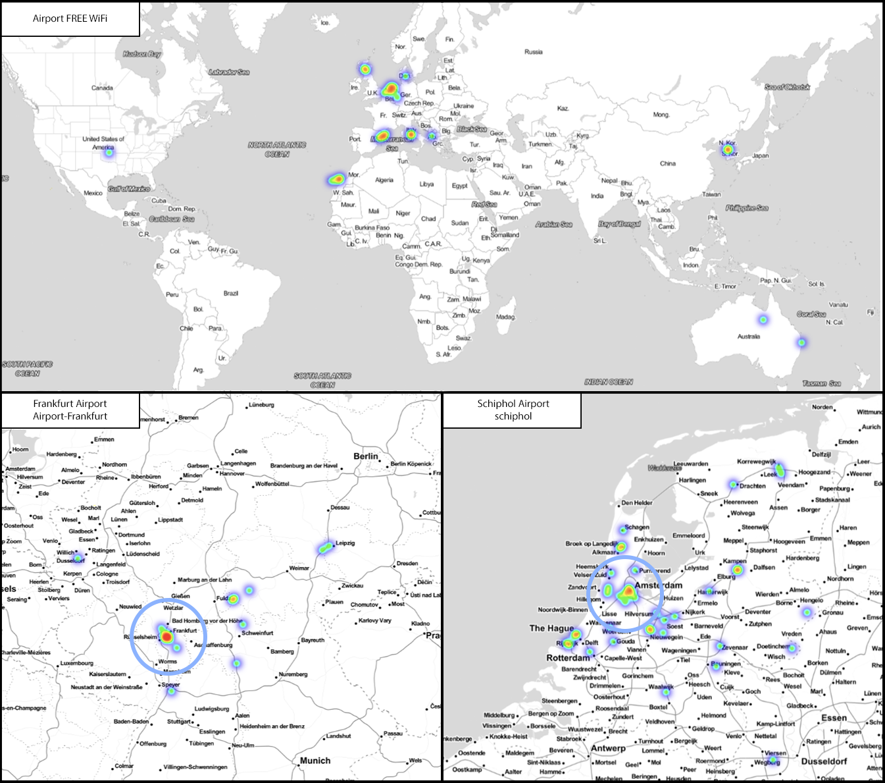
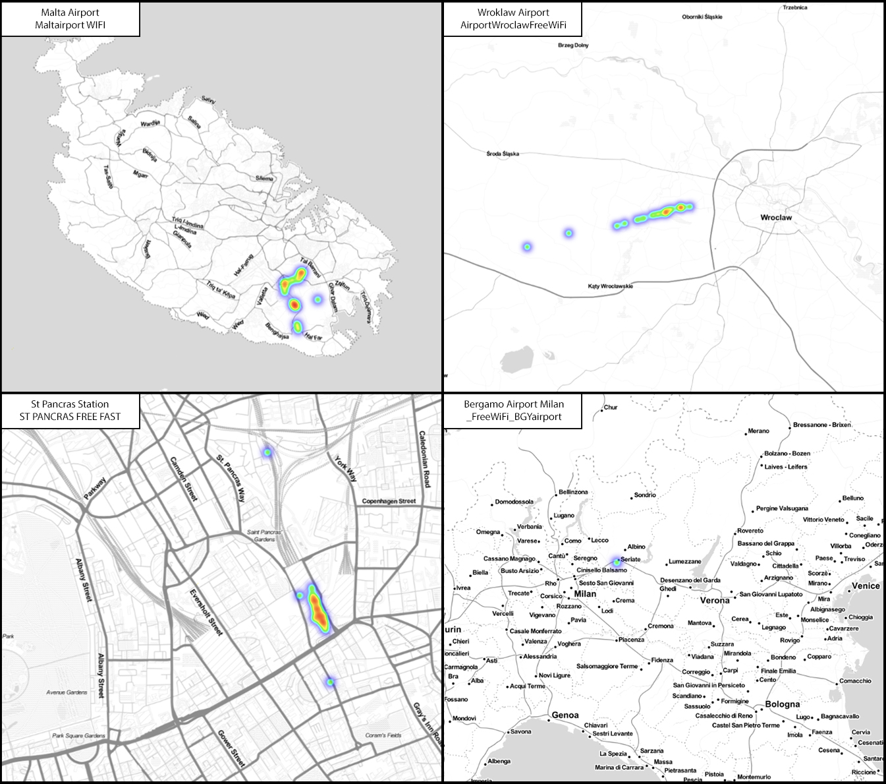

