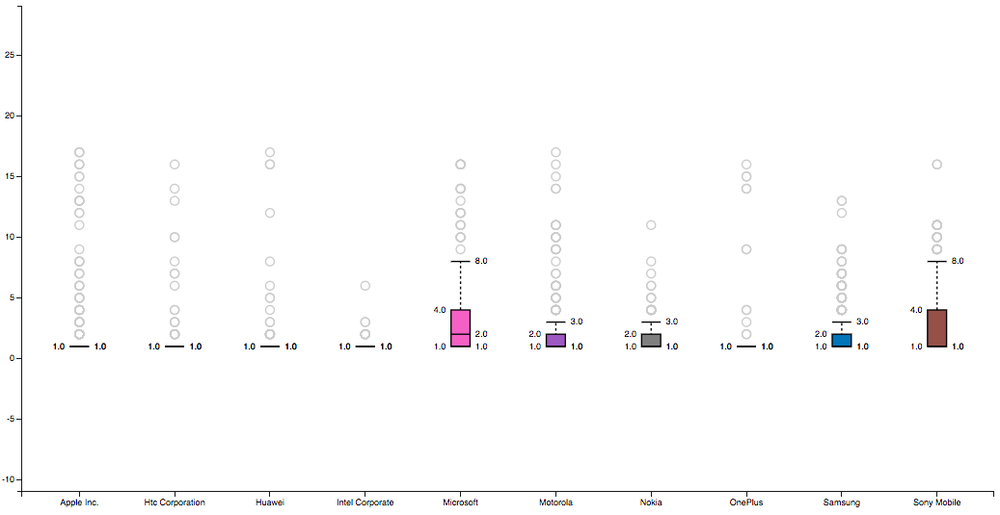
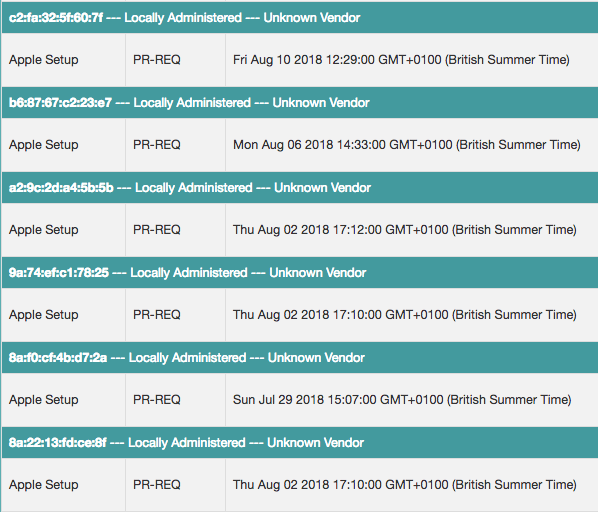
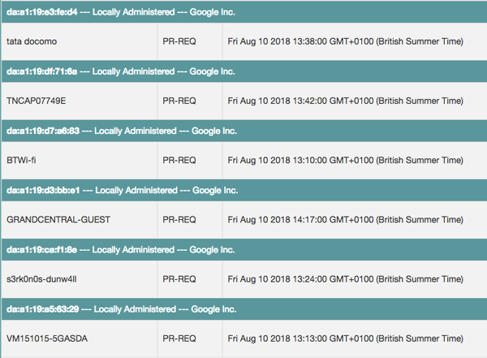

  

<strong>Project Area:</strong> Networking, Privacy, MAC Randomisation, Tracking, Visualisation  
<strong>Technologies:</strong> Mongo, Kali, Raspberry Pi, Javascript, Python & Flask, D3.js 
<strong>Mark:</strong> Distinction 79% - [Download PDF](https://www.attackingpixels.com/1/Robinson-1854199.pdf)

