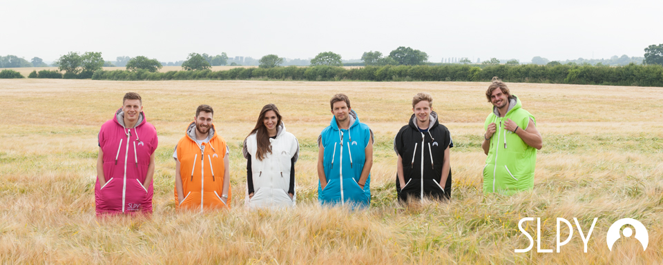
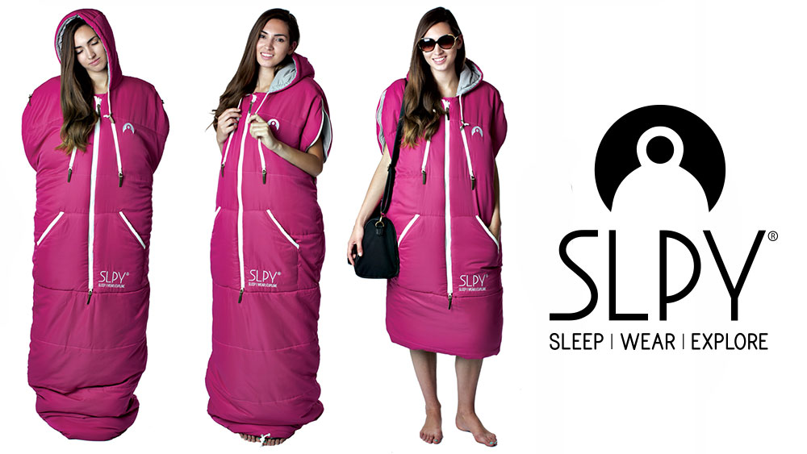
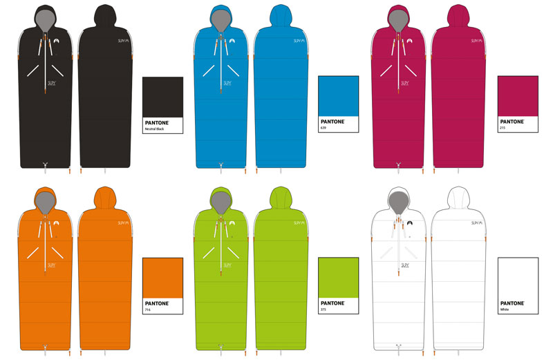
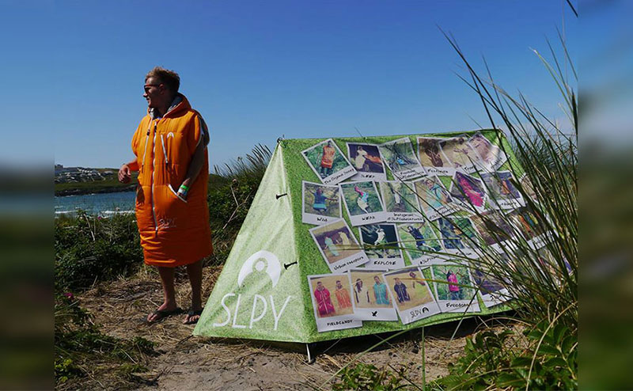

 

> <strong> Launch Material:</strong> The first SLPY product is the Original Sleepy, a wearable sleeping bag that looks great and keeps you warm. Whether you are on the edge of the woods, by a camp fire, or on the shores of a lake the Original Sleepy draws its inspiration from wanting to explore and will be your companion on your travels in the wild or the city. Despite its urban look it doesn’t compromise as a technical product that is also suitable for mountain wear as a high spec sleeping bag jacket.

The first task for this project was the creation of the SLPY brand identity.  The key themes through the branding process were to ensure we had a brand communicated the fun nature of the product, that the branding could draw parallels from contemporary street wear brands and that the branding had subtle relevance to the features of the product.
Upon many rounds of developments and revisions the final design comprised of a simple inverted silhouette of the hood section of the sleeping bag with the strap-line (sleep – wear – explore) to communicate the various configurations the product can be worn in.

An initial wearable sleeping bag, proof of concept prototype was produced in early 2014 to kickstart our development process. From this rough prototype we concluded that the overall mechanism of the the product would work and it was something that could be developed. At each critical stage of the design process a working prototype was manufactured in china and was systematically evaluated. This covered appearance, dimensions, material quality and anthropometrics.

Upon extensive product development the SLPY was soft launched at Boardmasters 2014 to coincide with the SLPY.com website launch. Prior to the grand unveiling further graphic assets we’re produced to support the SLPY product based on imagery from a product photoshoot. These designs included: business cards, t shirts, jumpers, polo shirts, a trade-stand a Fieldcandy tent collaboration.

Leading up to the product launch a series of marketing materials were released over social media. A range of images were posted to build hype with potential customers using Facebook, Twitter and Instagram using the #SLPYAdventueres. Competitions we’re also ran alongside the launch of the SLPY to win a bag with entrants uploading pictures to social media.