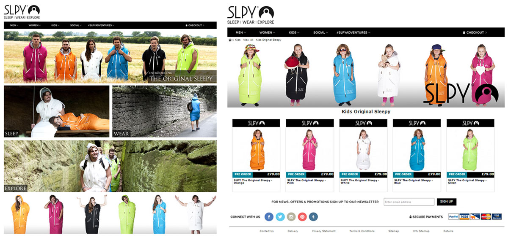
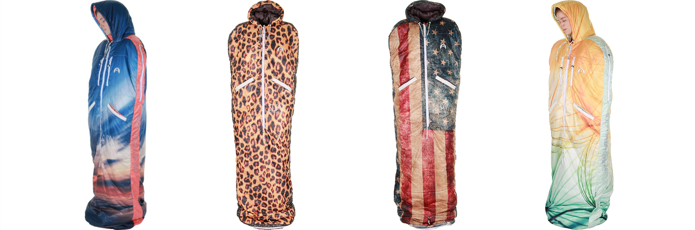

 
## SLPY MK.1 (The Original Sleepy)

<iframe width="560" height="315" src="https://www.youtube-nocookie.com/embed/NRJaerJzw_U" frameborder="0" allow="accelerometer; autoplay; encrypted-media; gyroscope; picture-in-picture" allowfullscreen></iframe>

> <strong> Launch Material:</strong> Introducing SLPY’s - Original Sleepy a wearable sleeping bag that looks great and keeps you toasty. The Original Sleepy allows you to explore in comfort and will be your companion in the wild or the city. Despite its colorful appearance it doesn’t compromise as a technical product which is suitable for mountain wear as a high spec sleeping and bag convertible jacket.

The key themes targeted in the branding process came from contemporary street wear brands, this was to help differentiate the product from the niche technical outdoors brands and to add a level of familiarity for the intended audience. The final logo which was comprised of a simple inverted silhouette of the hood section of the sleeping bag with the strap-line (sleep – wear – explore) to communicate the various configurations the product can be worn in.

An initial prototype was produced in early 2014 to validate the design. From this rough prototype we concluded that the overall mechanism of the product would work and it was something that could be developed. At each critical stage of the design process a working prototype was manufactured in china and then evaluated. These stages covered appearance, dimensions, material quality and anthropometrics. The MK.1 was available in 6 colorways.

Upon generating the initial product design, the SLPY was soft launched at Boardmasters 2014 to coincide with the SLPY.com website launch. Prior to the grand unveiling further graphic assets we’re produced to support the SLPY launch based on imagery from a product photoshoot. These designs included: promotional merchandise, a trade-stand and a Fieldcandy tent collaboration.

Social engagement was achieved using the #SLPYAdventueres hashtag on Facebook, Twitter and Instagram. Competitions we’re ran at the launch event to win a bags and further competitions we’re undertaken after launch encouraging owners to take pictures of themselves “Sleep - wear - explore”-ing in their SLPYS.

## SLPY MK.2

After a just over a year of the MK.1 being on the market the MK.2 was launched. This product was manufactured in the UK which lead to increased production costs but resulted in a far more refined product. The marketing for the MK.2 was handled by Intermarketing agency in Leeds while Attacking Design still carried out product development.

The MK.2 made use of sublimation printing which allowed for the bags to become real statement pieces. The range of the MK.2 was far more extensive and featured several design collaborations with outdoor brands.

