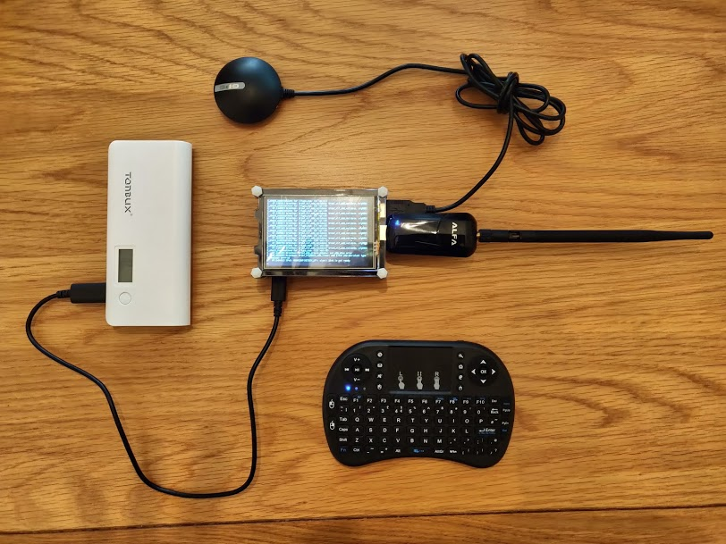
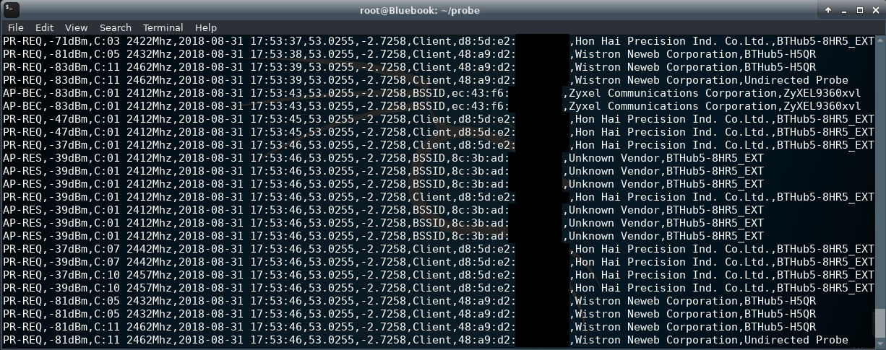
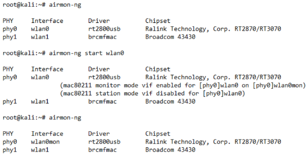
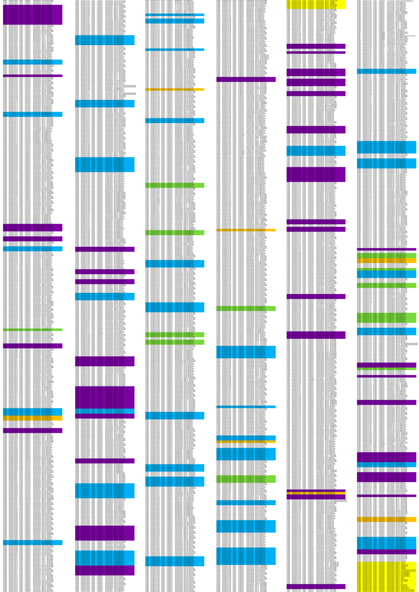

 
### Overview

To gather the dataset for my univeristy project I built a packet sniffing device based around a Raspberry Pi 3 B+. The Raspberry Pi ran Kali Linux (Re4son - Sticky Fingers Fork) used a monitor mode compatible Wi-Fi adapter (Alfa AWUS036NEH), GPS receiver (GlobalSat BU-353) and ran a my custom Python script [[GitHub]](https://github.com/adamistheanswer/PiSniffer). This Python script allows you to capture network management packets (probe requests) being broadcast from devices, the co-ordinates from where they been discovered, device manufacturers and the networks being seached for, in CSV format.

A rudimentary case was produced from a plastic container and zip ties to allow for transportation in a backpack during data collection. The device was powered using a high capacity power bank which allowed the device to run for around 4 hours, dependent on the levels of GPS & WI-Fi activity received.

Using a Bluetooth keyboard and the 3.5” TFT running from the Raspberry Pi’s GPIO (General Purpose Input Output) interface, the system could be operated anywhere. This focus on portability removed the need to SSH into the Raspberry Pi.



### Installation

```javascript
// Clone Repo
$ git clone https://github.com/adamistheanswer/PiSniffer
```

```javascript
// Aircrack-ng tools required. Install for these commands non Kali System
// Kali command to change wifi receiver into monitor (promiscuous) mode
$ airmon-ng start wlan0
// Run airodump against monitor mode interface for channel switching
$ airodump-ng wlan0mon
```

```javascript
// In new terminal navigate to script and run with (set file name)
$ python sniffGPS.py -m wlan0mon -f [output file name]
```



### ALFA AWUS036NEH 2.4 GHZ

The Alfa AWUS036NEH Wi-Fi adapter was selected as it operated at 2.4GHz and can scan all b/g/n 802.11 standards. The adapter comes equipped with a removable high gain aerial which out of the box gives very high range, and uses the Ralink RT3070 Chipset which was capable of being switched into monitor mode. Terminal commands demonstrating turning the chosen adapter from station mode into monitor mode using airmon-ng from the aircrack-NG suite can be seen here;



### Discovering devices and their trusted networks 🔐

The collection script developed for the project tested capable of detecting the closed set of devices through their MAC addresses and SSIDs contained within directed probe requests. As illustrated in this highlighted dataset.



Due to factors such as different onboard hardware running on each device and operating systems, probes are transmitted in different patterns of network discovery packets and with different densities and timings. MAC identifiers for Laptops and mobile devices we're discovered throughout testing with this script and worryingly devices which should by now hide personally identifiable MAC addresses we're vunerable to disclosing both you and the networks you have been previously connected to. If you'd like to read more about how this device was used check out my [Visualising Device Footprints Through 802.11 Probe Requests project](https://www.attackingpixels.com/Visualising-Unprotected-Probe-Requests/).