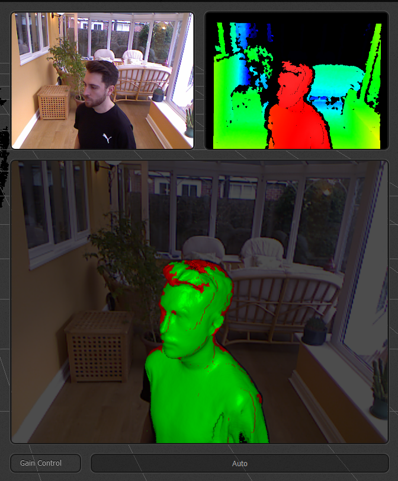
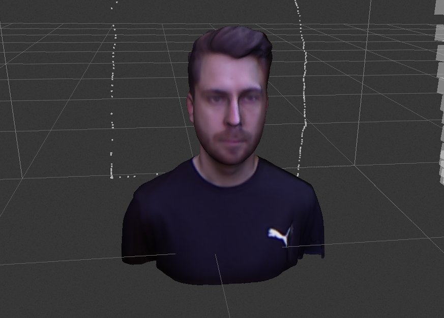
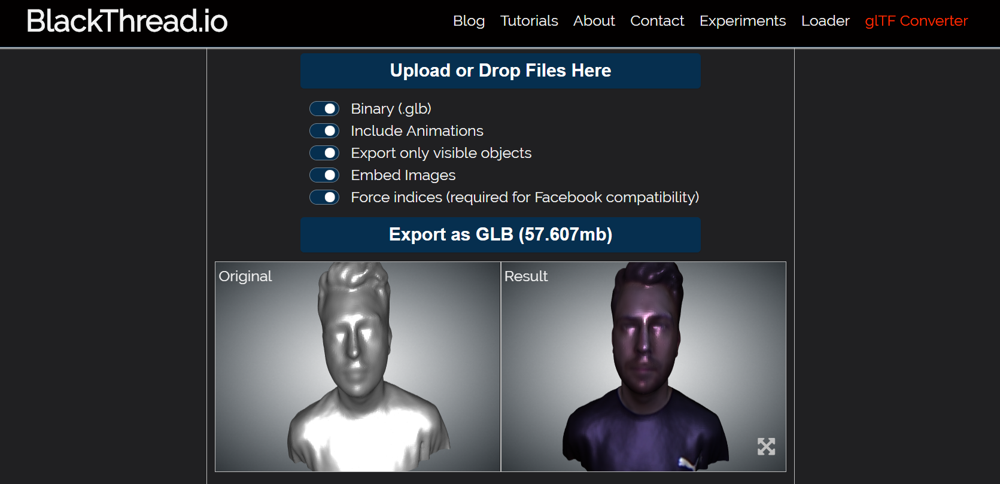
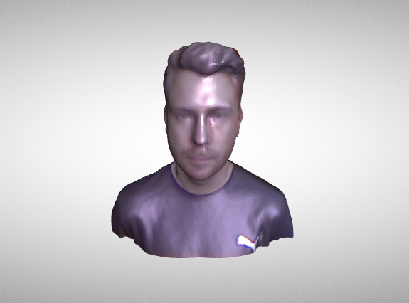
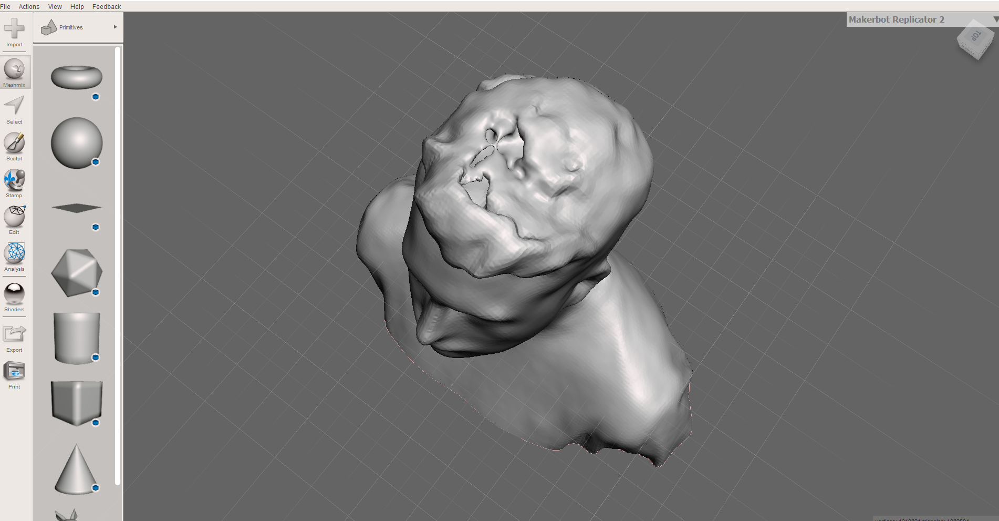
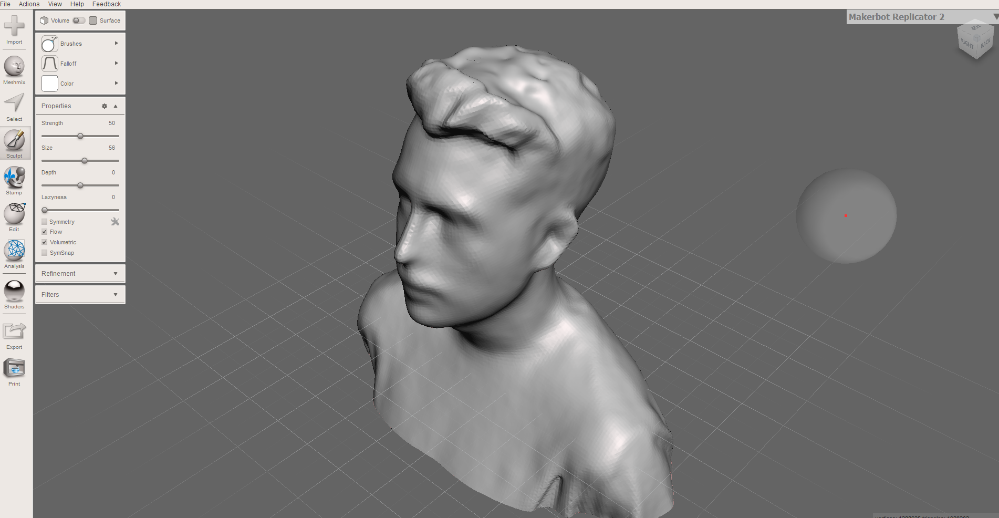

After experimenting with three.js I set myself the goal of producing a 3D self portrait which I could render in the browser. Using a second hand [X360 Kinect](https://uk.webuy.com/product-detail?id=s360kinsoxb&categoryName=xbox-360-accessories&superCatName=gaming&title=x360-official-kinect-with-psu-%28no-game%29) which I bought for £12, and through considerable trial and error, I achieved some decent results. Below is an interactive example of a finished model running in my three.js .gltf (Google Draco compressed) model viewer which can be found on [github](https://github.com/adamistheanswer/gltfLoader)

<iframe id="adam-face-3d" width="100%" height="350" scrolling="no" frameborder="no" src="https://confident-snyder-a05c9e.netlify.com/"></iframe>

Here's an overview of the workflow I devised, if you want to have a go at producing one yourself. 

1. Use XBOX 360 Kinect mk1 with Skanect to capture 3D model and texture data
2. Export model in .ply format with per vertex colouring
3. Convert .ply to .gltf using [blackthread.io .gltf converter](https://blackthread.io/gltf-converter/)
4. Use Meshmixer to carry out small repairs to the model
5. Use AnalyticalGraphicsInc's gltf-pipeline for compression using Draco .gltf
6. Open .gltf model file in a text editor and adjust surface properties
7. Load into three.js viewer
8. PROFIT!! 💸💸💸


### Scanning with the kinect

The Kinect mk1 turned out to be a really capable 3D scanner when paired with the Kinect SDK and Skanect, considering it was released in Nov 2010 and you can pick one up for the price of a few beers 🍺  

It's a two person task, to get a scan using the kinect to work out and you'll need to have a few trial runs to get the hang of it. My first attempts resulted in completely mangled models! 

When your capturing, make sure that the subject rotates on the spot while the sensor is only moved along the Z-axis. This ensures that lighting is being picked up from the same source on each sweep, giving much more consistent colouring to the model. I managed this by taking the back off an Ikea office chair and rotating about 30°'s at a time like a human turntable.



Above you can see Skanect capturing the 3D point cloud data represented in green and texture data in red. You can also see me looking very serious... Initially I wanted to capture myself pulling a manic grin, however my face would ache by the last pass and inevitably your expression would alter slightly during the time taken to capture with the single sensor. This would result in the geometry not matching between the first and last frame. My advice would be to do with with your mouth closed as the depth sensor really struggles with the inside of a mouth!



Above you can see a finished skanect recording ready for exporting to 3D model format. The white dotted line represents the path which the sensor has taken to build the model, notice the sensor has traveled in vertical lines and horizontally when it has reached the top and the bottom of the pass, as mentioned this is from me rotating and not the sensor moving around what is being captured.. this works much better!

When you're happy with the captured data you're going to want to export in .ply with per vertex colour. I tried all the available output formats and experimented with applying image data to the model through per vertex colouring and exporting a seperate UV texture map, but I've concluded these two output settings worked best. 

The texture detail of the model using per vertex colouring is lower than with a texture map as you're effectively colouring in the models polygons and not stretching the actual photos taken with the kenect over the top of the model. However you gain the flexibility of having the colour data in the same 3D file you're working with which makes conversion and adjustments much, much, much easier!



### Making the model usable

[blackthread.io](https://blackthread.io/gltf-converter/) have a web based gltf conversion tool which you can use to convert your .ply export into .gltf format. When you upload you're model you won't see the texture in the original window, but you will see it in the result model. This is one of the many pro's of the colour data being preserved in the model through using per vertex colouring, especially during format conversion. You will notice two things with your new model... the file size is on the large size for being loaded in the browser and it's really shiny... but we can fix that later!



At this stage you're going to want to carry out any minor repairs or touch ups you need to the model. You might get to a point where you've got an almost perfect model but the sensor has struggled on ears, nostrils, hair... ect, This can be easily modeled out with Meshmixer through smoothing the model or brushing in extra material.

[🎧 Hole in the head](https://www.youtube.com/watch?v=VxCpfFLyBGE)



Meshmixer won't display the texture of the model but trust me the colour data is still there! Try and be sparing with these touch ups as the new geometry will take the colour of the nearest poly and you don't want to have large single colour sections as this will look a bit patchy.



### Making the model web ready

With the fixes complete you can save the model and marvel at how the file size is far too large to be respectfully loaded in a browser. Here comes Analytical Graphics Inc's gltf-pipeline tools to the rescue. You can install this globally onto your machine and then compress your model using the following command through the cli-tool.

```javascript
// https://github.com/AnalyticalGraphicsInc/gltf-pipeline
$ gltf-pipeline -i inputModel.gltf -o outputModel.gltf -d
```

>Draco is a library for compressing and decompressing 3D geometric meshes and point clouds. It is intended to improve the storage and transmission of 3D graphics - Google

The -d flag in the cli-tool turns on Googles Draco model compression. Ideal! Through including draco in the workflow I was able to reach compression rates of around 92% bringng my models into the range of < 5mb. Just about small enough for the browser! Using draco did require me to install a draco model decompiler in the model viewer.

Now the last step is to manually correct the material properties of the model by opening up the model file in a text editor. Scroll down to the bottom of the file (it will be a big one) and look for metallicFactor & roughnessFactor. You're going want to set the metallic factor to 0 and the roughness to 2 as shown here.


```javascript
...
"materials": [
    {
      "pbrMetallicRoughness": {
        "baseColorFactor": [
          0.8,
          0.8,
          0.8,
          1
        ],
        "metallicFactor": 0,
        "roughnessFactor": 2
      },
      "emissiveFactor": [
        0,
        0,
        0
      ],
      "alphaMode": "OPAQUE",
      "doubleSided": false
    }
  ],...
```

Load the model into the three.js viewer I've modified, Et voila! If you've followed along to this, fingers crossed you'll have a snazzy 3D self portrait to show for it. Please leave a comment if you have any ideas on how this could be improved or if you've found this helpful.
