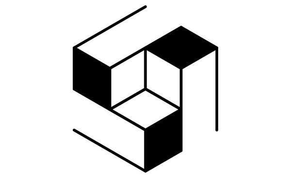

This is my XYZ aluminum space frame, tadpole recumbent bicycle build. XYZ spaceframe bikes focus on a low cost, light weight, highly durable construction and require only simple hand-held, non-specialized tools to produce. My recumbent design is based the open source design language distributed by N55 and collaborator Tim Wolfer. The XYZ design language draws its name from the three axes of space and uses their convergence as a point of interlocking strength. This allows for extremely strong 90° geometry to be produced with no welds necessary.

Using the XYZ spaceframe design language allows for all manner of bike configurations to be built such as  [cargo bikes](http://www.n55.dk/manuals/spaceframevehicles/2.jpg), [food bikes](http://www.n55.dk/manuals/spaceframevehicles/cargocoffee.jpg) & [trikes](http://www.n55.dk/manuals/spaceframevehicles/cargoskraafron.jpg). N55 focus their efforts on open source design and manufacturing techniques, which allow for sustainable, localised production and repair. For XYZ bikes spare parts are cheap and easy to produce!

<iframe width="560" height="315" src="https://www.youtube.com/embed/jf9Kw_8vFZs" frameborder="0" allow="accelerometer; autoplay; encrypted-media; gyroscope; picture-in-picture" allowfullscreen></iframe>

For my build I aimed to produce and MVP, keeping cost to a minimum. I achieved large cost savings through the use of traditional derailleur gearing opposed to an internally geared hub for the drive train. I also used two recycled wheel chair wheels for the front, opposed to using wheels with [recumbent hubs](http://www.sturmey-archer.com/en/products/detail/xl-sdd). Wheelchair wheels are designed to be side loaded and their hubs have standard straight through 1/2” bearing, similar to modern moutnain bike quick release systems.

